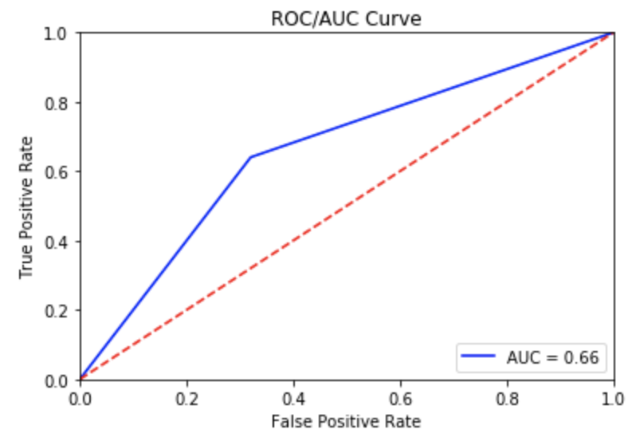

# **Classification Modeling for Uber & Lyft Subreddits**

## **Overview**
The objective of this project is to create a classification model that can distinguish the difference between the words used in the Uber and Lyft subreddits.

## **Problem Statement**
In Italy, ride-sharing is banned due to safety concerns. However, due to recent petitions, Italy is considering approving the launch of Uber or Lyft. I have been tasked to determine the public view on both Uber and Lyft to see whether one app should be launched over the other. Using text data in Uber and Lyft Subreddits to build a classification model, I will provide insight on whether Uber or Lyft should be chosen for Italy's ride-sharing launch.

## **Repository Contents:**
1. **[Code]** *Reddit - Webscraping.ipynb*:  Scrapes data off Subreddit and saves as .csv file on date, time scrapped.

2. **[Code]** *Reddit - EDA.ipynb*:  Merging datasets acquired from scraping, cleaning data, NLP preprocessing, modeling, inferences, and visualizations.

## **Data Dictionary**
|Feature|Type|Description|
|---|---|---|
|**title**|*str*|The title of the submission in a subreddit.|
|**num_comments**|*str*|The number of parent comments for each submission in a subreddit.|
|**elapsed_time**|*str*|The day(s) since the submission was posted on the subreddit.|
|**subreddit**|*str*|Subreddit title.|
|**body**|*str*|The body text of the submission in a subreddit.|
|**comments**|*str*|The parent comment text of the submission in a subreddit.|
|**all_text**|*str*|The combined text for title, body, and comments of the submission in a subreddit.|
|**alltxt_lemmatize**|*str*|WordNetLemmatizer preprocessing applied to the all_text column for each submission.|
|**alltxt_toktok**|*str*|TokTokTokennizer preprocessing applied to the all_text column for each submission.|
|**alltxt_porter**|*str*|PorterStemmer preprocessing applied to the all_text column for each submission.|
|**alltxt_snowball**|*str*|SnowballStemmer preprocessing applied to the all_text column for each submission.|

## **Executive Summary**
After examining the language used in the different subreddits, the data shows that there isn't a difference between the way people talk about Uber vs. Lyft. These two ride-sharing applications are viewed similarly amongst the public on Reddit.

## **Conclusions & Recommendations**
Without the keywords 'uber' or 'lyft' being used for the classification model, it cannot distinguish well between the words used in the Uber and Lyft subreddits. This is indicated by the poor accuracy scores that are around 60% for the test data as well as the cross-value of 5 folds for the training data. Including words that have coefficient weights around 1.0 to stopwords decreased the accuracy of the model from ~60% to ~50%.

The sentiment polarity scores of the texts are inaccurate to the actual sentiment of the submission. Therefore, the polarity scores will not be considered for analysis.

The ROC/AUC Curve shows that false positives occur almost 40% of the time. In other words, the model can't classify between Uber and Lyft submissions that well without using the words "uber" and/or "lyft."

I would recommend also looking at the pros and cons for each app when deciding which ride-share app to launch in Italy (*https://www.ridester.com/uber-vs-lyft/*). However, if my client wants to decide which app to launch based on purely Uber & Lyft Subreddit data, I would say that you could launch either/both because people view them quite similarly.

## **Sources**

https://www.oyster.com/articles/where-is-uber-banned-around-the-world  
https://www.tripadvisor.com/ShowTopic-g187768-i20-k10342140-Uber_or_Lyft-Italy.html
https://www.ridester.com/uber-vs-lyft/
https://www.reddit.com/r/cutouts/comments/6q5a6l/can_someone_give_me_a_round_cutout_of_the_reddit/
https://apps.apple.com/us/app/uber/id368677368
https://apps.apple.com/us/app/lyft/id529379082
